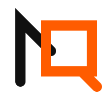

<p align="center">
  
</p>

<h1 align="center">Nemo.Q</h1>

<p align="center">
  <strong>精准问询，还原真相。</strong><br />
  一款专为高保真智能决策设计的工业级数据智能引擎。
</p>

<p align="center">
  <a href="#-核心特性">核心特性</a> •
  <a href="#-技术栈">技术栈</a> •
  <a href="#-快速开始">快速开始</a> •
  <a href="#-设计原则">设计原则</a>
</p>

---

Nemo.Q 将原始的数据库交互转化为“深空手术室”般的决策驾驶舱体验，提供透明、可溯源且具备极致精确性的数据洞察。

## ✨ 核心特性

- **智能推理流水线 (Agentic Pipeline)**：实时可视化 AI 代理从思维到行动的决策全过程，让每一步分析都清晰可见。
- **洞察画布 (Insight Canvas)**：动态、沉浸式的协作空间，用于可视化数据异常、趋势及复杂的分析逻辑。
- **问询流 (Ask Flow)**：交互式澄清机制，在执行前解决业务逻辑歧义，确保 100% 的决策准确率。
- **SQL 审计协议 (SQL Audit)**：严格的服务端 Schema 校验与透明的执行日志，满足企业级的审计与合规要求。
- **语义层架构 (Semantic Layer)**：自动化的语义引导技术，无缝衔接原始数据架构与自然语言意图。
- **手术级美学 (Surgical Aesthetics)**：极致极简的 UI 设计，融合了 **Safety Orange (警戒橙)** 专业配色、几何构架与高级感质感。

## 🚀 技术栈

- **前端**: Next.js 15+, React 19, TailwindCSS (Vanilla CSS 精调)
- **AI 编排**: Vercel AI SDK, ActFlow 多代理框架
- **数据层**: 支持异构数据库驱动 (PostgreSQL, MySQL, ClickHouse)
- **视觉设计**: 动态 SVG 图腾, 响应式流体布局, 工业级微交互

## 🛠 快速开始

### 1. 环境准备
确保您的设备已安装 `node >= 20` 及 `pnpm` 或 `npm`。

### 2. 安装依赖
```bash
pnpm install
```

### 3. 配置环境
在根目录创建 `.env.local` 文件并配置您的 AI 模型密钥及数据库连接：
```env
OPENAI_API_KEY=your_key_here
DATABASE_URL=your_db_connection_string
```

### 4. 启动开发服务器
```bash
pnpm dev
```

## 📐 设计原则

Nemo.Q 的设计遵循 **“减法美学”**：
- **确定性 (Certainty)**：使用硬边缘与高对比度配色（警戒橙）。
- **通透感 (Transparency)**：通过悬浮布局与动态扫描线减少视觉压抑。
- **响应性 (Responsiveness)**：每一个交互都应具备物理级的丝滑反馈。

---

*Precision In, Truth Out.* — **Nemo.Q 团队**
